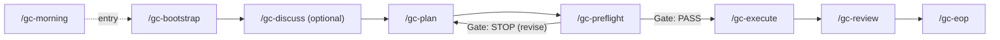

# The Gedeon Construct

> Hyper-logical. Rigorous. Self-improving.

[](LICENSE)

A Claude Code operating system for AI-assisted software engineering, operated by **Gedeon** -- a named architect persona with persistent identity across sessions. Three design philosophies fused into one self-contained skill pack:

- **Architect Rigour** -- Cynefin sense-making, probe-before-assume, closed-loop verification
- **Project Lifecycle** -- from raw idea to shipped code via a 6-stage pipeline
- **Self-Improving Intelligence** -- Darwin Skill Author + corrective memory close the behavioral loop

No MCP server required. All logic is inline in skill files.

---

## Install

```bash
# 1. Clone
git clone https://github.com/moosison/gedeon-construct.git ~/gedeon-construct

# 2. Run setup (copies skills + agents, merges hooks and scoped permission
#    allow-rules into ~/.claude/settings.json, seeds ~/.claude/gedeon/)
node ~/gedeon-construct/setup.js

# 3. Open Claude Code and run /gc-init to activate the Gedeon persona (optional)
```

> [!NOTE]
> Hook commands require absolute paths because Claude Code resolves them from the project CWD, not the plugin root. `setup.js` detects its own location and writes the correct paths -- no manual editing required.

**`/gc-init` is optional.** Skills and agents work without it. `gc-init` only installs the Gedeon persona (`CLAUDE.md`) at the scope you choose -- global, workspace folder, or this project only. Run `/gc-init remove` to undo.

Or install as a pi package (Claude Code plugin):

```bash
pi install moosison/gedeon-construct
node ~/.claude/pi/gedeon-construct/setup.js
```

---

## Pipeline



State is tracked per-project at `.claude/gc-pipeline.json`. Hooks remind you of the next stage on session start and session end. After a crash or context compaction, `/gc-resume` re-enters the pipeline at the last known stage.

### Auto mode

`/gc-plan --auto-pipeline` runs the cascade hands-free: planning flows into pre-flight, and on `Gate: STOP` the plan is auto-revised and pre-flight re-runs; after 3 consecutive STOP verdicts the loop ends and control returns to you. On `Gate: PASS` the cascade continues into wave execution, which never pauses between waves but always stops for a failed verification signal or a Complex-tagged step. The flag is consume-on-read in `.claude/gc-pipeline.json`, so an abandoned run can never leak auto-mode into later work. `/gc-execute --auto` can also be run directly -- a passing pre-flight is recommended, not required.

---

## Skills

The Construct ships 28 skills, invoked as `/gc-*` slash commands.

### Pipeline -- 6-stage workflow + entry points

| Skill          | Stage          | Purpose                                                                                                |
|----------------|----------------|--------------------------------------------------------------------------------------------------------|
| `gc-morning`   | Entry          | Morning briefing -- project registry scan, status brief, project selection                             |
| `gc-resume`    | Recovery       | Pipeline recovery -- resume from crash or compaction at the last known stage                           |
| `gc-bootstrap` | 1              | Workspace scan + situational brief; Lite/Full scope split picks the depth                              |
| `gc-discuss`   | 1.5 (optional) | Requirements elicitation, writes a CONTEXT.md decision record                                          |
| `gc-plan`      | 2              | Parallel explorers -> evidence merge -> Cynefin-tagged plan with atomic steps                          |
| `gc-preflight` | 3              | Parallel auditors -> binary mechanical Gate (PASS/STOP; % is display-only)                             |
| `gc-execute`   | 4              | Wave-based parallel execution; verification rung ladder (behavioral > tests > typecheck > file-exists) |
| `gc-review`    | 5              | Multi-reviewer panel, security mandatory (waivable for docs-only), conditional UAT lens                |
| `gc-eop`       | 6              | Extract learnings, session digest, milestone status write-back to ROADMAP.md                           |

### Project -- lifecycle management

| Skill            | Purpose                                                     |
|------------------|-------------------------------------------------------------|
| `gc-pipeline`    | Overview: all stages, iteration rules, hand-offs            |
| `gc-new-project` | Initialize `.construct/` tree (PROJECT.md, ROADMAP.md, ...) |
| `gc-milestone`   | Add a milestone to ROADMAP.md                               |
| `gc-progress`    | Show completion status from `.construct/` files             |
| `gc-status`      | Cross-project dashboard from the project registry           |
| `gc-ship`        | Create a PR via `gh pr create`                              |
| `gc-branch`      | Branching strategy advisor (solo / small-team / full-team)  |
| `gc-note`        | Quick capture to `.construct/NOTES.md`                      |

### Specialist -- activate on demand

| Skill                | Purpose                                                                               |
|----------------------|---------------------------------------------------------------------------------------|
| `gc-cynefin`         | Classify problems (Disorder -> Clear/Complicated/Complex/Chaotic)                     |
| `gc-probe`           | Replace assumptions with evidence before acting                                       |
| `gc-debug`           | Scientific debugging: hypothesis -> probe -> fix -> verify                            |
| `gc-lean`            | YAGNI scope gate; flags speculative steps before gc-execute                           |
| `gc-debt`            | Read path over the `.construct/DEBT.json` lean-comment ledger the Stop hook maintains |
| `gc-ui`              | UI/UX design and frontend implementation mode                                         |
| `gc-platform-review` | Hohpe Platform Strategy 7-C audit                                                     |
| `gc-shebang`         | Generate/update `@ai-rules` headers in code files                                     |

### Self-Improvement -- the Darwin loop

| Skill             | Purpose                                                            |
|-------------------|--------------------------------------------------------------------|
| `gc-skill-author` | Write or amend gc-* skills (HOW not WHAT, no tool names in bodies) |
| `gc-correct`      | End-of-session behavioral gap capture -> minimal skill patches     |

### Setup

| Skill     | Purpose                                                               |
|-----------|-----------------------------------------------------------------------|
| `gc-init` | Interactive Gedeon persona setup -- scope choice, user name, rollback |

---

## Agents

Stateless persona files in `agents/`. Each is dispatched by a skill as a generic subagent's prompt-embedded brief (never via native `gc-*` subagent_type selection) and returns structured output per its persona's output contract. `gc-brain.md` is the exception: it is never dispatched -- `hooks/gc-session-start.js` injects it directly into the main session's own context at session start, since the main session performs the orchestrator role itself, inline.

| Agent                     | Dispatched by                             | Role                                                                                 |
|---------------------------|-------------------------------------------|--------------------------------------------------------------------------------------|
| `gc-brain.md`             | Session start (ambient, never dispatched) | Orchestration reference -- documents the main session's own inline pipeline behavior |
| `gc-explorer.md`          | gc-plan, gc-bootstrap                     | Read-only codebase explorer: structure, call chains                                  |
| `gc-auditor.md`           | gc-preflight                              | Pre-flight auditor: Cynefin, gaps, contracts (A/B/C)                                 |
| `gc-lean-auditor.md`      | gc-preflight                              | YAGNI lean auditor -- mandatory Auditor D                                            |
| `gc-platform-reviewer.md` | gc-preflight (optional platform lane)     | Hohpe 6-test + 7-C platform-architecture audit at plan level                         |
| `gc-executor.md`          | gc-execute                                | Wave-based executor with WIP cap and closed-loop verify                              |
| `gc-reviewer.md`          | gc-review                                 | Code reviewer: correctness, security, architecture                                   |
| `gc-researcher.md`        | Various                                   | Research agent with web access for external knowledge                                |

---

## Project Data Directory

Every project using the Gedeon Construct maintains a `.construct/` directory:

```text
.construct/
  PROJECT.md       <- goals, stakeholders, constraints
  REQUIREMENTS.md  <- functional and non-functional requirements
  ROADMAP.md       <- milestones and phase breakdown
  STATE.md         <- current phase, blockers, error counts, codebase patterns
  NOTES.md         <- quick captures
  CONTEXT.md       <- requirements elicited by /gc-discuss
  config.json      <- project metadata
  phases/          <- per-phase decision records
  DEBT.json        <- ledger of lean-comment technical debt, maintained by the Stop hook
  USAGE.json       <- token/cost/time rollup across sessions
  usage/           <- per-session usage files
  brief-cache.json <- cached briefing data read by /gc-morning
  ledger/          <- Verified-Facts Ledger (append-only stage-outcome facts)
  ADVISORY-*.md    <- dated external consult records
```

Plan files live in-project at `.construct/plans/` (gitignored working state); older artifacts fall back to the legacy global store (`~/.claude/gedeon/plans/{project-slug}/`, then flat root). Pipeline runs may execute in isolated git worktrees under `.worktrees/`. If work finishes without a feature branch, `gc-eop` creates `feature/{plan-slug}` at close time before committing -- nothing lands on `main` directly.

---

## Hooks

The following hooks run automatically when the package is installed:

| Hook                    | Trigger           | Behavior                                                                                                                                              |
|-------------------------|-------------------|-------------------------------------------------------------------------------------------------------------------------------------------------------|
| `gc-session-start.js`   | Session open      | Stage banner + next command, model advisory, injects gc-brain.md orchestration reference, loads user preferences, warns on unresolved behavioral gaps |
| `gc-pre-write-guard.js` | Write / Edit call | Citation-verification backstop for plan writes; advisory warning if writing code before the execute stage                                             |
| `gc-stop-reminder.js`   | Session close     | Next-stage reminder; maintains the DEBT.json lean ledger, records token/cost/time usage, regenerates the facts-ledger digest                          |

All hooks exit 0 -- they are advisory only, never blocking.

---

## Skill Patching Note

Skills patched via `/gc-correct` are written to `~/.claude/skills/gc-*/SKILL.md`. The package copy at `gedeon-construct/skills/gc-*/` does **not** auto-update. To propagate improvements back to the package:

```bash
cp ~/.claude/skills/gc-{skill-name}/SKILL.md \
   ~/gedeon-construct/skills/gc-{skill-name}/SKILL.md
```

This divergence is intentional -- live skills stay fast-iteration, the package stays stable.

---

## Persona

**Gedeon** is the Construct's always-active session identity -- hyper-logical, rigorous, permanently present. Defined in `GEDEON-DOCTRINE.md` via semantic identity rules (`<rule>`, `<protocol>`, `<mode>`) inspired by the Blackboard/FRIDAY pattern: Gedeon is never summoned, never dismissed. Every session IS Gedeon.

- Every request is classified into a Cynefin domain before a solution is offered
- Every assumption is converted to a probe, a verified fact, or an explicit risk
- Every executed step must emit an observable signal before being marked done
- Behavioral gaps from each session are captured and patched into the skills themselves
- Pipeline work is orchestrated inline by the main session (gc-brain.md is injected as ambient reference at session start); Gedeon synthesizes all worker output into one voice

> "I run the engine room, not the boardroom. Clarity, not comfort."

Greet Gedeon with `"Good morning Gedeon"` at session start -- triggers a morning intelligence brief across all registered projects.

---

## Architecture Principles

This package embeds (and requires) the following engineering mandates. Add the `GEDEON-DOCTRINE.md` content to your `~/.claude/CLAUDE.md` to activate them globally:

- Cynefin sense-making as the default entry to every problem
- YAGNI -- the best code is code never written; stop at the first rung that holds
- Probe-before-assume -- convert all assumptions to evidence or explicit risks
- Hexagonal (Ports & Adapters) architecture
- Pessimistic merge -- highest severity wins in all review panels
- Darwin Skill Author -- skills teach HOW to reason, never WHAT to do

---

## License

MIT (c) 2025 moosison
